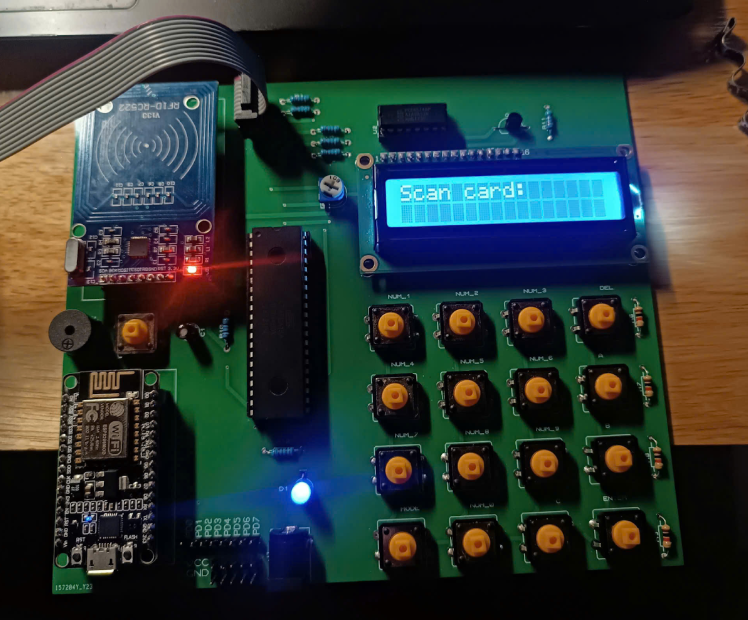

# DOOR SECURITY DEVIDE USING ATMEGA16

- This project provide a program for a system with the core MCU is ATmega16. The program include all the library for communicate with the peripheral devices on the hardware.
- The main program of the system is for a 2 layer security on the hardware, first is the RIFD scan card and second is a 4 digits password entering by a 4x4 keypad.
- All the information can be display on a LCD 16x2. The password can be changed through the 4x4 keypad. The system can also communicate with a webserver through a ESP8266/ESP32 (transfer and receive the singal between the Atmega 16 and ESP).

## 1. THE PCB HARDWARE DEVICE
The hard ware device is design by using the **Proteus**.

**The accessory include:**
- Atmega 16 MCU
- RFID_RC522 module   
- LCD 16x2
- PCF8574 PIC *(I2C convert for LCD)*
- 4x4 Keypad *(hand made with normal button)*
- ESP8266/ESP32

## 2. PROGRAM CODING
The software coding include the library base on the ATmega16 MCU (AVR core) for communicate with the peripheral device.

The coding file in running with the **Atmel Studio IDE**.

### I2C
All basic functions for a I2C framework transmit data.
### LCD
All init and basic functions for command on the LCD.
### PWM
Init function to the output motor *(a servo for open/close the door)*.
### RFID
All init and functions for SPI communicate on RFID_RC522 for scanning a MIRARE card.
### UARD
All init and funtions to transmit and receive data between ATmega16 and ESP8266.